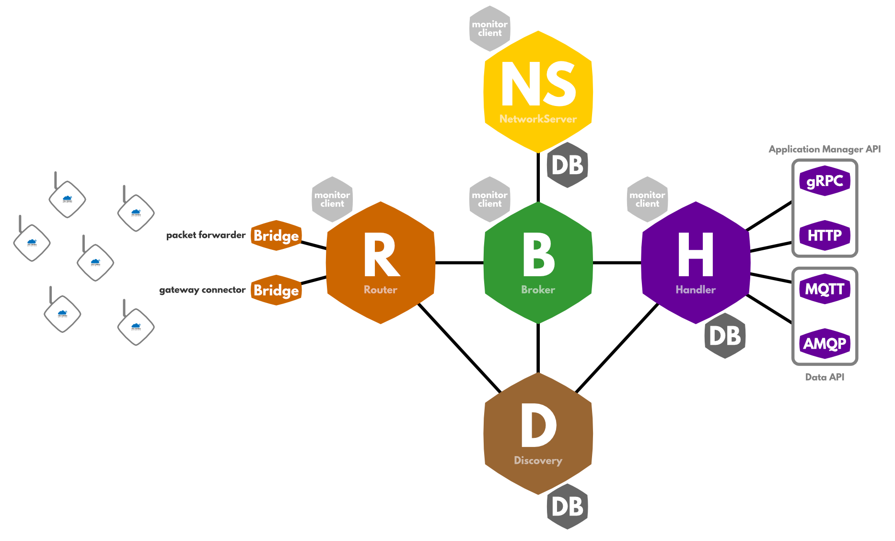

# Internet of Things - Groupe infrastructure
Dans le cadre du cours IOT à la HEIG-VD, Suisse.

## Introduction
Le groupe infrastructure est responsable de mettre en place une solution permettant à des capteurs de communiquer par réseau LoRaWAN avec une application web développée par les groupes front-end et back-end.

Pour cela, il a été décidé de mettre en place notre propre infrastructure LoRaWAN afin de pouvoir héberger l'application web sur un serveur LoRaWAN que nous allons installer sur une machine se trouvant dans le réseau interne de l'école. Quant aux données, elles seront stockées dans une base de données PostgreSQL tournant sur le serveur LoRaWAN.

L'objectif est donc de mettre en place une infrastructure réseau en installant un network-server LoRaWAN et ses différents composants afin que les capteurs LoRa et l'application web puissent communiquer entre eux.

## Technologies utilisées

Pour commencer à mettre en place notre infrastructure réseau, nous avons choisi d'utiliser un network-server LoRaWAN open-source mis à disposition par CableLabs sur le site [loraserver.io](www.loraserver.io).

Le network-server est formé de plusieurs composants que nous allons décrire ci-dessous.

### Gateway

Antenne LoRa qui est connectée au module de routage. Elle redirige les transmissions radio LoRa au network-server.

### Network-server

Le network-server est responsable des fonctionnalités spécifiques à LoRaWAN.

### Broker

Le broker est la partie centrale du réseau. Il doit gérer le statut de la gateway

## Spécificités
[Spécificités à savoir pour la partie du projet (possibilités de configuration)]

## Déploiement
Dans ce chapitre, nous allons voir comment est déployée l'infrastructure

## Conclusion
[Points à améliorer, points en suspens, améliorations futures, ...]

## Documentation supplémentaire

- [loraserver.io](www.loraserver.io) website
- [Network documentation](https://www.thethingsnetwork.org/docs/network/) on TTN website