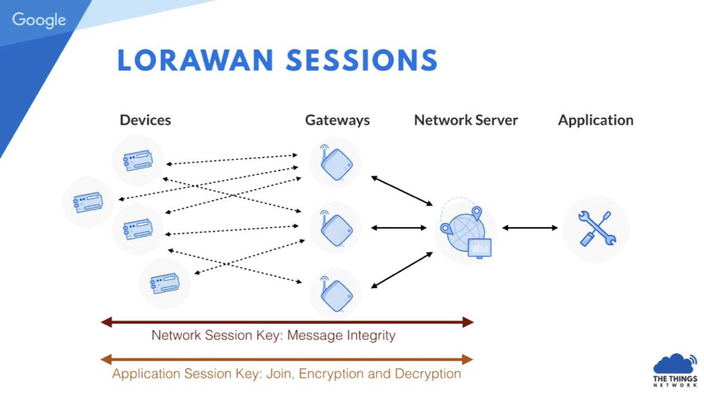
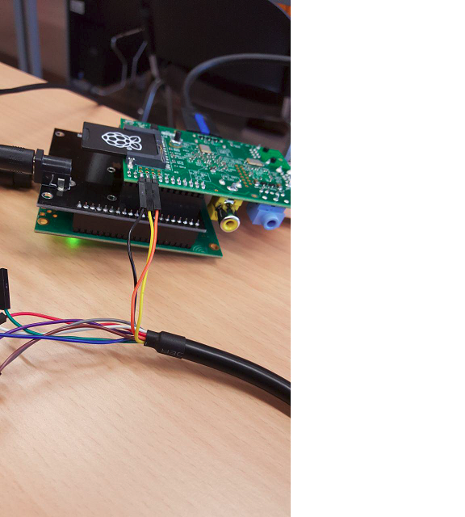

# Internet of Things - Groupe infrastructure
Dans le cadre du cours IOT à la HEIG-VD, Suisse.

## Introduction
Le groupe infrastructure est responsable de mettre en place une solution permettant à des capteurs de communiquer par réseau LoRaWAN avec une application web développée par les groupes front-end et back-end.

Pour cela, il a été décidé de mettre en place notre propre infrastructure LoRaWAN afin de pouvoir héberger l'application web sur un serveur LoRaWAN que nous allons installer sur une machine se trouvant dans le réseau interne de l'école. Une base de données PostgreSQL tourne sur le serveur LoRaWAN pour stocker des données de configuration relatives au protocole LoRaWAN.

L'objectif est donc de mettre en place une infrastructure réseau en installant un network-server LoRaWAN et ses différents composants afin que les capteurs LoRa et l'application web puissent communiquer entre eux.

### Architecture LoRaWAN simplifiée



### Architecture LoRaWAN détaillée


## Technologies utilisées

Pour commencer à mettre en place notre infrastructure réseau, nous avons choisi d'utiliser un network-server LoRaWAN open-source mis à disposition par CableLabs sur le site [loraserver.io](www.loraserver.io).

Le network-server est formé de plusieurs composants et fonctionnalités que nous allons décrire dans ce chapitre.


### Devices LoRa

Les devices LoRa sont dans notre cas les capteurs qui envoient des données au réseau LoRaWAN en passant par les LoRa gateways.

### LoRa Gateway

Antenne LoRa qui est connectée au module de routage. Elle envoie les transmissions radio LoRa qu'elle reçoit des capteurs au network-server. Elle implémente un packet-forwarder permettant d'interfacer le hardware LoRa.

### LoRa Gateway Bridge

Le LoRa Gateway Bridge est responsable de la communication avec la gateway. Il transforme les paquets tranportés sur le protocole UDP en payloads JSON sur le protocole MQTT.


### Router

Ce module est chargé de gérer le statut de la gateway et d'organiser les transmissions (scheduling) car une gateway peut effetuer uniquement une transmission à la fois. Il est connecté à un ou plusieurs brokers.

### Broker

Le broker est la partie centrale du réseau. Il est responsable du mapping entre les devices LoRa et la ou les applications tournant sur le serveur d'applications. Son rôle est de rediriger un message en provenance d'un certain capteur à la bonne application et dans le cas du chemin inverse de distribuer le message au bon routeur qui va communiquer avec une gateway qui va elle à son tour relayer le message par transmissions radio LoRa au capteur destinataire.

A noter qu'il peut y avoir plusieurs brokers au sein du network-server.

### Network-server

Le network-server est responsable des fonctionnalités spécifiques à LoRaWAN. Il a pour tâche de contrôler chaque device et chaque application enregistrée. Pour ce faire, il demande au serveur d'applications si le node (device) est autorisé dans le réseau et, si oui, quels paramètres il faut appliquer à ce node.

### Handler

Le handler doit gérer les données relatives à une ou plusieurs applications. Pour ce faire, il se connecte à un broker où sont enregistrés les différents capteurs et applications ainsi que le mapping entre eux.

C'est également dans le handler que les données sont cryptées ou décryptées.

### Gateway Protocol Translation

Quand une gateway reçoit un message transmis avec LoRa, elle encapsule et redirige le message au réseau LoRaWAN. Beaucoup de gateways utilisent le même protocole de référence proposé par LoRa mais d'autres protocoles ont été développés pour des backends spécifiques.

### Downlink configuration

Avec LoRaWAN, le temps de réponse du downlink, c'est-à-dire le message allant de l'application au capteur, est dépendant de la localisation géographique de la gateway.

Le module de routage est chargé de gérer les informations relatives aux gateways existantes dont leur position géographique et doit déterminer comment retourner une réponse au capteur.

Après chaque requête qu'un capteur envoie à l'application (message uplink), le router créé deux fenêtres de réponse. La première a lieu exactement 1 seconde après avoir reçu le message du capteur et la deuxième 2 secondes après avoir reçu le message. Donc pour chaque requête reçue sur chaque gateway, le router construit deux downlink configurations.

Afin de pouvoir sélectionner la meilleure option de gateway par laquelle envoyer la réponse au capteur, le router calcule un score pour chaque downlink configuration. Le score pour chaque configuration est influencé par plusieurs facteurs tels que le temps de propagation dans l'air, la force du signal, le taux d'utilisation de la gateway et les réponses déjà planifiées par le router (scheduling). Par exemple plus le signal est fort, meilleure est la qualité de la transmission et plus la gateway est utilisée, plus celle-ci doit probablement être fiable.

### Déduplication

LoRaWAN est un protocole radio à longue portée, ce qui signifie qu'il est plus que probable que plusieurs gateways reçoivent et retransmettent un message envoyé par un device LoRa, ce qui génère une déduplication du message envoyé. Le broker est chargé de gérer les messages reçus afin de filtrer les messages dupliqués et de n'envoyer qu'une seule fois le message à l'application.

Les messages dupliqués peuvent quand même s'avérer utiles. Les métadonnées de ces messages peuvent être analysées pour trouver la position exacte du device LoRa qui a envoyé la requête et aussi pour mettre à jour les données permettant au module de routage d'améliorer le calcul du score des downlink configurations de manière à rediriger les réponses (messages downlink) aux gateways de façon optimale.

### LoRa App Server

Le LoRa App Server est comme son nom l'indique un serveur d'applications. Il est open-source et est responsable de faire l'inventaire des devices communicant avec l'infrastructure LoRaWAN. Il gère les demandes d'accès des devices aux applications et la réception des payloads de l'application.

LoRa App Server dispose d'une interface web permettant à l'administrateur de gérer les utilisateurs, les devices et les applications autorisés à passer par l'infrastucture du réseau LoRaWAN. Grâce aux APIs RESTful et gRPC, il est possible de faire de l'intégration de services externes.

Lors des transmissions entre les applications et les devices LoRa, les données sont envoyées et reçues en utilisant les protocoles MQTT et/ou HTTP(S).


#### REST API pour le LoRa App Server


#### Exemple d'applications ajoutées


## Spécificités

Il faut être connecté au réseau de l'école ou utiliser un VPN pour pouvoir atteindre les différents composants du système.

#### VM sur le serveur de l'école :
* Ubuntu 18.04 LTS bionic beaver 
* 50GB de mémoire
* 2GB de RAM
* CPU DualCore
* Adresse IP:  10.192.72.26  
* Nom de domaine: iot_lora.lan.iict.ch
* docker: installation de docker-ce, package du 04 mai 2018
#### Gateway : 
* Raspberry Pi 3 B
* RASPBIAN STRETCH LITE 4.14 (pas de bureau graphique)
* SD card 4GB
* connexion à un écran: HDMI
* connexion à la console Raspberry via un câble série. L'émulateur de terminal (PuTTY par exemple) 
* connexion internet: Ethernet (réception adresse du pool DHCP de l'école)
* carte Lora: iC880A-SPI


## Déploiement
Dans ce chapitre, nous allons voir comment a été déployée l'infrastructure et comment installer et accéder aux différents composants du système.

### Accès à la VM sur le serveur de l'école
Pour accéder à la VM sur le serveur de l'école, il faut tout d'abord se connecter au réseau de l'école puis ouvrir un terminal et taper une des deux commandes suivantes:


###### ssh -l heiguser 10.192.72.26  


###### ssh -l heiguser iot_lora.lan.iict.ch

Remarque : il est possible qu'à ce stade, un message d'erreur apparaisse en indiquant qu'il n'est pas possible d'ajouter l'hôte à la liste des hôtes connus. Ignorez et tapez "yes" pour continuer.

Un mot de passe est ensuite demandé pour établir la connexion à distance. Tapez le mot de passe suivant pour accéder au compte "heiguser" (compte root):

##### groupe-infra-pass

### Accès à l'interface graphique du LoRa Server
Ouvrez votre navigateur et accéder au lien suivant:

<https://iot_lora.lan.iict.ch:8080>


Votre navigateur vous dira qu'il ne fait pas confiance au certificat du serveur : ajoutez une exception pour continuer.

Il faut ensuite saisir l'utilisateur "admin" et le mot de passe "groupe-infra-pass-interface".


### Lancement de la topologie LoRa depuis la VM
Dans le cas où la topologie docker ne serait pas lancée sur le serveur (impossibilité de se connecter à l'interface graphique du LoRa Server), il faut accéder à la VM via un terminal comme expliqué plus haut, au compte "heiguser" puis au dossier /home/heiguser/home/Documents/repos/loraserver-docker.
Tapez la commande suivante pour démarrer le LoRa Server:

##### docker-compose up 

### Accès à la gateway
Pour accéder à la gateway, il y a deux possibilités: soit on veut accéder à distance via l'interface graphique du LoRa Server, soit directement via un câble série ou HDMI.

Quelle que soit la méthode de connexion, le user et le mot de passe sont respectivement "pi" et "raspberry".

####  Câble HDMI
La connexion est aisée puisqu'il suffit simplement de connecter un câble HDMI au Raspberry faisant office de gateway et de le relier à un écran pour le output. Si le Raspberry est en train de tourner, l'image l'interface s'affiche automatiquement à l'écran.

#### Câble série
Avec le câble série, il faut être attentif au branchement suivant sur la gateway:


Branchez ensuite la partie USB sur votre machine et à l'aide d'un émulateur de terminal (PuTTY par exemple), spécifiez une connexion série avec un port 115200 et l'hôte COM qui correspond à celui configuré pour le périphérique USB de votre machine (peut être configuré sur le gestionnaire de périphériques).

Remarque: vous ne pourrez pas vous connecter en série si vous n'avez pas activé le SPI sur le Raspberry (voir installation gateway pour plus de détails).

#### Depuis le LoRa Server
En se connectant à l'interface graphique du LoRa Server (connexion nécessaire au réseau de la HEIG-VD) à l'adresse suivante <https://iot_lora.lan.iict.ch:8080/> (user : admin, pasword: groupe-infra-pass-interface), cliquer sur l'onglet "Gateways", puis sélectionner "IotGateway" qui est la seule gateway ajoutée pour l'instant. Il est possible de consulter la localisation de cette gateway, ainsi que de configurer le LoRa network server auquel elle est liée.
### Installation de la gateway
Ce chapitre explique comment mettre en place une gateway à partir d'un Raspberry Pi modèle 2B.

#### Installation de l'OS Raspbian
La première étape consiste à installer un système d'exploitation sur la carte SD du Raspberry. 
L'OS choisit est décrit plus haut dans les spécificités.

Il faut ensuite insérer la carte SD dans le Raspberry et brancher l'alimentation pour le démarrer.

La procédure est vraiment très simple. Vous trouverez plus de détails à l'adressse <https://www.raspberrypi.org/learning/software-guide/>, notamment comment préparer la carte SD.
#### Installation LoRa-Gateway sur la gateway
Il faut désormais équiper le Raspberry du LoRa-gateway. Pour commencer, connectez la carte Lora (iC880A-SPI) au Raspberry.

Accédez au terminal du Raspberry, puis tapez la commande : 

###### $ sudo raspi-config

Une interface de configuration va s'ouvrir. Il faudra activer le SPI en allant sur "Interfacing options". Ensuite, dans "Advanced options" choisissez "Expand filesystem".

Ces modifications seront prisent en compte lors du redémarrage.

Par la suite, il va falloir configurer la "time zone":

###### $ sudo dpkg-reconfigure locales

###### $ sudo dpkg-reconfigure tzdata

Installer git si ce n'est pas déjà fait:

###### $ sudo apt-get update

###### $ sudo apt-get upgrade

###### $ sudo apt-get install git


Installation de Lora Gateway:

###### 1- cloner le repo https://github.com/Lora-net/lora_gateway.git 

###### 2- cd lora_gateway/

###### 3- make all

###### 4- ./reset_lgw.sh start


Installation du Packet Forwarder

###### 1- cloner le repo https://github.com/Lora-net/packet_forwarder.git

###### 2- cd /packet_forwarder

###### 3- sudo ./compile.sh

###### 4- make all

###### 5- sudo nano /packet_forwarder/local_config.json et faire les modifications suivantes:
```
{
 ...
"gateway_conf":{
  "gateway_ID": B827EBFFFE1EE042
  }
}
```
###### 6- sudo nano /packet_forwarder/global_config.json et faire les modifications suivantes:
```
{
 ...
"gateway_conf":{
  "gateway_ID": B827EBFFFE1EE042,
  "server_address":"10.192.72.26",
  "srrv_port_up": 1700,
  "srrv_port_down": 1700,
  ...
  }
}
```

Lancement de la gateway:


###### 1- cd packet_forwarder/lora_pkt_fwd/

###### 2- sudo ./update_guid.sh ./local_config.json => pour update le EUI de la gateway

###### 3- cd packet_forwarder/lora_pkt_fwd/

###### 4- sudo ./lora_pkt_fwd


La gateway devrait être opérationnelle à présent.
#### Ajouter la gateway au Network Server
Comme expliqué au chapitre "Accès à la gateway", il suffit de se connecter à l'interface graphique du LoRa server et accéder à l'onglet de configuration des gateways pour établir un lien avec un network server. Cependant, il faut créer au préalable un network server. Pour cela, il faut accéder à la page "Network Servers" puis cliquer sur "Add Network Server".
Il faut spécifier le nom et l'adresse du network server. Actuellement, le network server en place possède le nom "infra-net-serv" et le hostname "loraserver:8000".

### Connexion entre le LoRa App Server et l'application web (frontend)
Pour héberger une application frontend, une image Docker appelée "passenger" est à disposition sur la VM du serveur de l'école : /home/Documents/passenger.

Dans ce dossier, un dockerfile permet de construire une image mettant en place un serveur web Nginx et définissant l'application à déployer et sa configuration.

L'application frontend à déployer se trouve dans /home/Documents/passenger/web-app et sa configuration dans /home/Documents/passenger/conf. 

Dans le dockerfile, les lignes spécifiant le déploiement du frontend sont les suivantes:

###### COPY --chown=app:app web-app/helloWorld.js /home/app/webapp
###### ADD conf/webapp.conf /etc/nginx/sites-enabled/webapp.conf

Remarque: ici, il's'agit d'un exemple avec une app "HelloWorld". Il faut la remplacer par l'app que l'on souhaite déployer.


L'image Docker "passenger" est donc indépendante du reste de l'infrastructure. Par conséquent, il faut build cette image et la run avec la commande suivante (attention à respecter le bon port-mapping):

###### docker run —name passenger -p 3000:3000 infra/phusion-passenger


### Connexion entre le LoRa App Server et l'application web (backend)
Le backend possède sa propre infrastructure. Il faut cependant établir, sur le LoRa server, un lien entre le backend et le device (ici: un capteur).

Pour cela, il faut créer un "service-profile", un "device" et une "application".
Tout cela est possible via l'interface graphique du LoRa server sous les différents onglet correspondants. 

Il est à noter, qu'un "device" est défini par son nom, une description, son identifiant EUI et le "service-profile" utilisé. Actuellement le nom est "test-sensor-5", son EUI "0004a30b001a1e25" et son "service-profile" est "firm-dev-profile". Le "service-profile", défini un état de communication en spécifiant par exemple le newtwork server (infra-net-serv) utilisé ou la fréquence des requêtes de status du "device". L'application est définie par son nom est le "service-profile" utilisé (ici respectivement "backend" et "firm-dev-profile").


### LoRa Server REST API
Il est possible de communiquer avec le LoraServer grâce à une API REST détaillée à l'adresse suivante: <https://iot_lora.lan.iict.ch:8080/api>


## Conclusion
L'infrastructure est en place et fonctionne. On constate que la connexion fonctionne entre la gateway et le device. Voici le trafic reçu par la gateway:


En ce qui concerne la communication entre le device et le LoRa server, voici ce qui est reçu:


## Documentation supplémentaire

- [loraserver.io](www.loraserver.io) website
- [Network documentation](https://www.thethingsnetwork.org/docs/network/) on TTN website