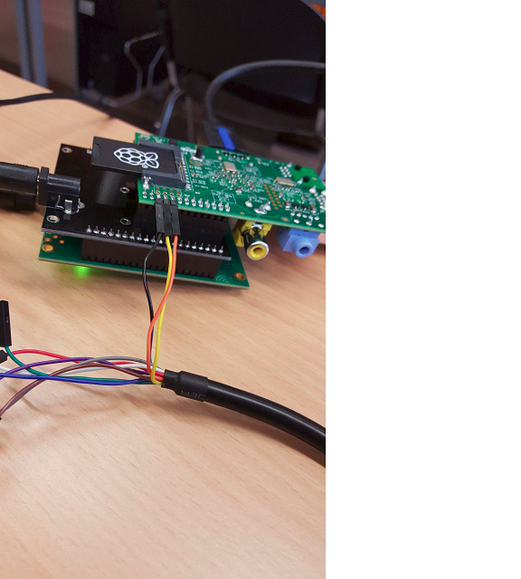

# Internet of Things - Groupe infrastructure
Dans le cadre du cours IOT à la HEIG-VD, Suisse.

## Introduction
[Introduction à ce repository]
Par exemple: Ce repository est consacré à la partie...

## Technologies utilisées
[Technologies utilisées]

## Spécificités

Il faut être connecté au réseau de l'école ou utiliser un VPN pour pouvoir atteindre les différents composants du système.

#### VM sur le serveur de l'école :
* Ubuntu 18.04 LTS bionic beaver 
* 50GB de mémoire
* 2GB de RAM
* CPU DualCore
* Adresse IP:  10.192.72.26  
* Nom de domaine: iot_lora.lan.iict.ch
* docker: installation de docker-ce, package du 04 mai 2018
#### Gateway : 
* Raspberry Pi 3 B
* RASPBIAN STRETCH LITE 4.14 (pas de bureau graphique)
* SD card 4GB
* connexion à un écran: HDMI
* connexion à la console Raspberry via un câble série. L'émulateur de terminal (PuTTY par exemple) 
* connexion internet: Ethernet (réception adresse du pool DHCP de l'école)
* carte Lora: iC880A-SPI

## Déploiement
Dans ce chapitre, nous allons voir comment a été déployée l'infrastructure et comment installer et accéder aux différents composants du système.

### Accès à la VM sur le serveur de l'école
Pour accéder à la VM sur le serveur de l'école, il faut tout d'abord se connecter au réseau de l'école puis ouvrir un terminal et taper une des deux commandes suivantes:

###### ssh -l heiguser 10.192.72.26  

###### ssh -l heiguser iot_lora.lan.iict.ch

Remarque : il est possible qu'à ce stade, un message d'erreur apparaisse en indiquant qu'il n'est pas possible d'ajouter l'hôte à la liste des hôtes connus. Ignorez et tapez "yes" pour continuer.

Un mot de passe est ensuite demandé pour établir la connexion à distance. Tapez le mot de passe suivant pour accéder au compte "heiguser" (compte root):

##### groupe-infra-pass

### Accès à l'interface graphique du LoRa Server
Ouvrez votre navigateur et accéder au lien suivant:

<https://iot_lora.lan.iict.ch:8080>

Votre navigateur vous dira qu'il ne fait pas confiance au certificat du serveur : ajoutez une exception pour continuer.

Il faut ensuite saisir l'utilisateur "admin" et le mot de passe "groupe-infra-pass-interface".

### Lancement de la topologie LoRa depuis la VM
Dans le cas où la topologie docker ne serait pas lancée sur le serveur (impossibilité de se connecter à l'interface graphique du LoRa Server), il faut accéder à la VM via un terminal comme expliqué plus haut, au compte "heiguser" puis au dossier /home/heiguser/home/Documents/repos/loraserver-docker.
Tapez la commande suivante pour démarrer le LoRa Server:

##### docker-compose up 

### Accès à la gateway
Pour accéder à la gateway, il y a deux possibilités: soit on veut accéder à distance via l'interface graphique du LoRa Server, soit directement via un câble série ou HDMI.

Quelle que soit la méthode de connexion, le user et le mot de passe sont respectivement "pi" et "raspberry".

####  Câble HDMI
La connexion est aisée puisqu'il suffit simplement de connecter un câble HDMI au Raspberry faisant office de gateway et de le relier à un écran pour le output. Si le Raspberry est en train de tourner, l'image l'interface s'affiche automatiquement à l'écran.

#### Câble série
Avec le câble série, il faut être attentif au branchement suivant sur la gateway:

Branchez ensuite la partie USB sur votre machine et à l'aide d'un émulateur de terminal (PuTTY par exemple), spécifiez une connexion série avec un port 115200 et l'hôte COM qui correspond à celui configuré pour le périphérique USB de votre machine (peut être configuré sur le gestionnaire de périphériques).

Remarque: vous ne pourrez pas vous connecter en série si vous n'avez pas activé le SPI sur le Raspberry (voir installation gateway pour plus de détails).

#### Depuis le LoRa Server
En se connectant à l'interface graphique du LoRa Server (connexion nécessaire au réseau de la HEIG-VD) à l'adresse suivante <https://iot_lora.lan.iict.ch:8080/> (user : admin, pasword: groupe-infra-pass-interface), cliquer sur l'onglet "Gateways", puis sélectionner "IotGateway" qui est la seule gateway ajoutée pour l'instant. Il est possible de consulter la localisation de cette gateway, ainsi que de configurer le LoRa network server auquel elle est liée.
### Installation de la gateway
Ce chapitre explique comment mettre en place une gateway à partir d'un Raspberry Pi modèle 2B.

#### Installation de l'OS Raspbian
La première étape consiste à installer un système d'exploitation sur la carte SD du Raspberry. 
L'OS choisit est décrit plus haut dans les spécificités.

Il faut ensuite insérer la carte SD dans le Raspberry et brancher l'alimentation pour le démarrer.

La procédure est vraiment très simple. Vous trouverez plus de détails à l'adressse <https://www.raspberrypi.org/learning/software-guide/>, notamment comment préparer la carte SD.
#### Installation LoRa-Gateway sur la gateway
Il faut désormais équiper le Raspberry du LoRa-gateway. Pour commencer, connectez la carte Lora (iC880A-SPI) au Raspberry.

Accédez au terminal du Raspberry, puis tapez la commande : 

###### $ sudo raspi-config

Une interface de configuration va s'ouvrir. Il faudra activer le SPI en allant sur "Interfacing options". Ensuite, dans "Advanced options" choisissez "Expand filesystem".

Ces modifications seront prisent en compte lors du redémarrage.

Par la suite, il va falloir configurer la "time zone":

###### $ sudo dpkg-reconfigure locales

###### $ sudo dpkg-reconfigure tzdata

Installer git si ce n'est pas déjà fait:

###### $ sudo apt-get update

###### $ sudo apt-get upgrade

###### $ sudo apt-get install git

Installer Mosquitto:

###### $ sudo apt-get install mosquitto

Cloner et installer le Lora-gateway:

###### $ git clone -b spi https://github.com/ttn-zh/ic880a-gateway.git ~/ic880a-gateway

###### $ cd ~/ic880a-gateway

###### $ sudo ./install.sh spi

#### Configuration du packet forwarder
!!!!!!!!!!!!!!!!!!!!!!!!!!!!!!!!!!!

La gateway devrait être opérationnelle à présent.
#### Ajouter la gateway au Network Server
Comme expliqué au chapitre "Accès à la gateway", il suffit de se connecter à l'interface graphique du LoRa server et accéder à l'onglet de configuration des gateways pour établir un lien avec un network server. Cependant, il faut créer au préalable un network server. Pour cela, il faut accéder à la page "Network Servers" puis cliquer sur "Add Network Server".
Il faut spécifier le nom et l'adresse du network server. Actuellement, le network server en place possède le nom "infra-net-serv" et le hostname "loraserver:8000".

### Connection entre le LoRa App Server et l'application web (frontend)
Pour héberger une application frontend, une image appelée "passenger" est à disposition sur la VM du serveur de l'école : /home/Documents/passenger.

Dans ce dossier, un dockerfile permet de construire une image mettant en place un serveur web Nginx et définissant l'application à déployer et sa configuration.

L'application frontend à déployer se trouve dans /home/Documents/passenger/web-app et sa configuration dans /home/Documents/passenger/conf. 

Dans le dockerfile, les lignes spécifiant le déploiement du frontend sont les suivantes:

###### COPY --chown=app:app web-app/helloWorld.js /home/app/webapp
###### ADD conf/webapp.conf /etc/nginx/sites-enabled/webapp.conf

Remarque: ici, il's'agit d'un exemple avec une app "HelloWorld". Il faut la remplacer par l'app que l'on souhaite déployer.

L'image Docker "passenger" est donc indépendante du reste de l'infrastructure. Par conséquent, il faut build cette image et la run avec la commande suivante (attention à respecter le bon port-mapping):

###### docker run —name passenger -p 3000:3000 infra/phusion-passenger

### Connection entre le LoRa App Server et l'application web (backend)
Le backend possède sa propre infrastructure. Il faut cependant établir, sur le LoRa server, un lien entre le backend et le device (ici: un capteur).

Pour cela, il faut créer un "service-profile", un "device" et une "application".
Tout cela est possible via l'interface graphique du LoRa server sous les différents onglet correspondants. 

Il est à noter, qu'un "device" est défini par son nom, une description, son identifiant EUI et le "service-profile" utilisé. Actuellement le nom est "test-sensor-5", son EUI "0004a30b001a1e25" et son "service-profile" est "firm-dev-profile". Le "service-profile", défini un état de communication en spécifiant par exemple le newtwork server (infra-net-serv) utilisé ou la fréquence des requêtes de status du "device". L'application est définie par son nom est le "service-profile" utilisé (ici respectivement "backend" et "firm-dev-profile").

### LoRa Server REST API
Il est possible de communiquer avec le LoraServer grâce à une API REST détaillée à l'adresse suivante: <https://iot_lora.lan.iict.ch:8080/api>

## Test de connexion entre la gateway et le LoRa server
!!!!!!!!!!!!!!!!!!!!!!!!!!!!!!!!!!!!!!!!

## Conclusion
[Points à améliorer, points en suspens, améliorations futures, ...]
!!!!!!!!!!!!!!!!!!!!!!!!!!!!!!!!!!!!!!!!!!!!!!!!!!!!!!!!!!!!!!!!!!!!

